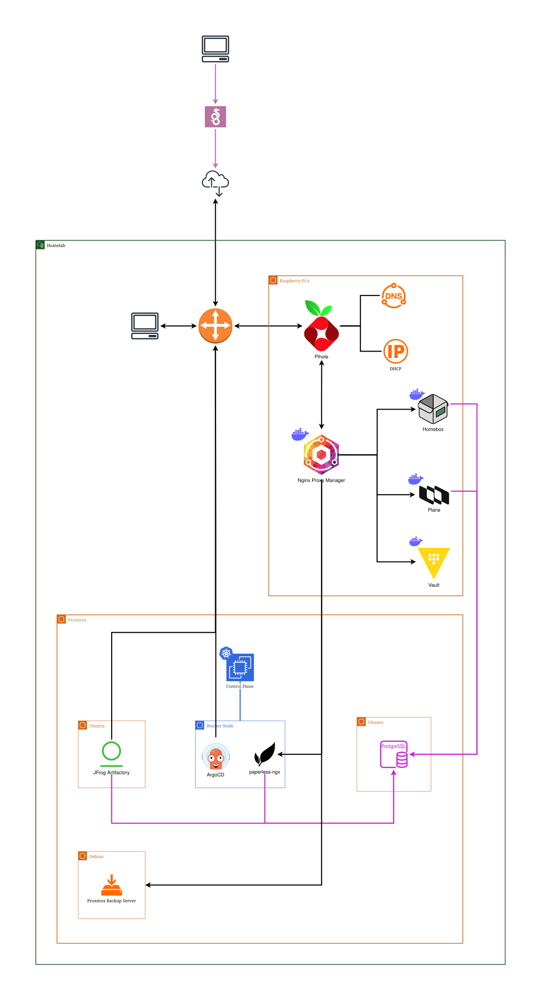

# Homelab

A personal infrastructure project built with OpenTofu, Packer, Proxmox, and Ansible. This homelab provides a complete, self-hosted environment for running containerized applications with automation, backups, and security-first design.

## About This Project

This is my personal homelab infrastructure - a learning project and practical environment for exploring modern infrastructure practices.
It demonstrates how to build a self-hosted platform using Infrastructure as Code, containerization, and automation.

**Why it exists**: I created this to have full control over my infrastructure, learn infrastructure automation at scale, and build a reliable platform for running personal applications and services.

**For others**: If you're building your own homelab or learning infrastructure concepts, feel free to use this as a reference, adapt it for your needs, or learn from the architectural decisions documented in [docs/decisions/](docs/decisions/). Questions and discussions are welcome—this project is meant to be shared and learned from.

## Tech Stack

| Layer                      | Technology |
| -------------------------- | ---------- |
| **Configuration**          | Ansible    |
| **Containers**             | Podman     |
| **Infrastructure as Code** | OpenTofu   |
| **VM Image Building**      | Packer     |
| **Hypervisor**             | Proxmox VE |
| **VMs / Base OS**          | Debian     |

## What This Is

A fully automated infrastructure stack that manages:
- **Virtualization**: Proxmox VE hypervisor with KVM/QEMU
- **Containers**: Podman-based application deployment via Ansible
- **Infrastructure**: OpenTofu for provisioning VMs and resources
- **VM Images**: Packer for building base images (Debian, Talos)
- **Automation**: Ansible playbooks for application deployment

## Diagram



## Quick Start

1. **Build VM images** - Use Packer to create base images for your hypervisor
2. **Provision infrastructure** - Apply OpenTofu configurations to spin up virtual machines
3. **Deploy applications** - Run Ansible playbooks to install and configure services

For details on each step, explore the corresponding directory in this project.

## Project Structure

```
homelab/
├── ansible/        # Application deployment automation
├── docs/           # Architecture documentation and decisions
├── kubernetes/     # Kubernetes cluster configuration
├── packer/         # VM image definitions
└── tofu/           # Infrastructure provisioning
```

## For Others

This is a personal project, but I welcome questions, discussions, and ideas from others building similar infrastructure. If you're:
- **Learning infrastructure concepts** - explore the code and architectural decisions
- **Building your own homelab** - adapt and use what works for your setup
- **Curious about specific decisions** - check [docs/decisions/](docs/decisions/) for the reasoning behind key choices

Feel free to open discussions or ask questions about how things are implemented.

## License

Licensed under [GPL-3.0](LICENSE).
